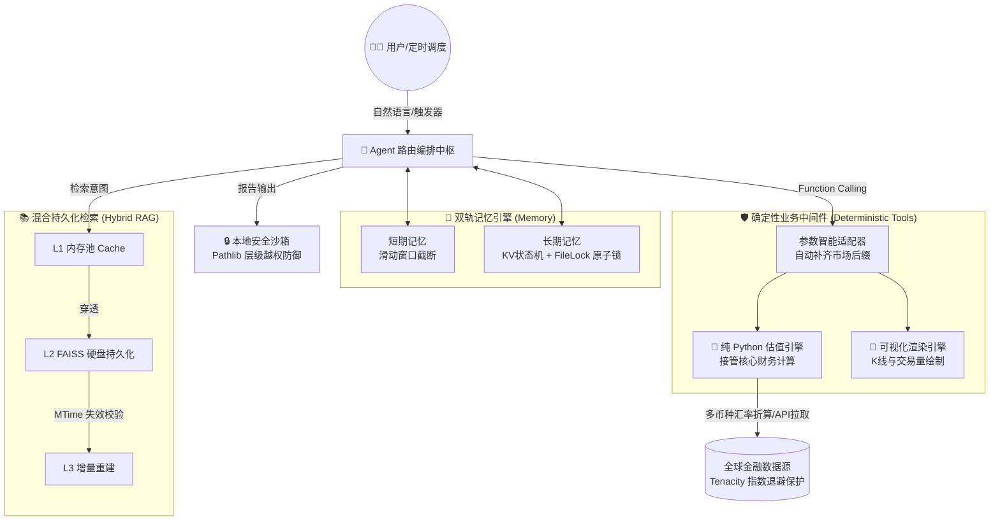

# 📈 OmniStock Agent | 企业级高可用量化分析智能体架构


OmniStock Agent 并非一个简单的“大模型 API 套壳”玩具，而是一个基于 LangChain 核心框架构建的**全栈、高容错、面向复杂业务落地的本地化智能体架构范式**。

本项目致力于向开发者与架构师展示：在剥离了华丽的 Prompt 之后，如何利用**确定性的工程手段**（中间件、容灾重试、混合缓存、安全沙箱、状态机）来接管大模型的脆弱性，从而构建出真正达到企业级可用性标准的 AI Agent 系统。

---

## 🏗️ 核心系统架构 (System Architecture)



---

## 💡 核心护城河与工程突破 (Engineering Highlights)

### 1. 🧮 业务解耦：彻底根除大模型“数值计算幻觉”
* **行业痛点**：大模型（LLM）本质是概率模型，在处理精确财务核算、多币种汇率折算时极易产生致命的“数值幻觉”。
* **架构解法**：剥夺大模型的数学计算权。设计独立的 `valuation_engine.py` 纯函数引擎，利用 CPU ALU 提供 100% 精确的单票盈亏计算与并发查价。大模型仅负责“意图识别”与最终的“逻辑组装”，彻底斩断财务幻觉。

### 2. ⚡ 高可用与极速容错控制 (Resiliency & Retry)
* **行业痛点**：量化联网查询极易遭遇 502 或网络抖动，导致主线程永久挂起。
* **架构解法**：在网络 I/O 顶层注入全局 Socket 熔断器；利用 `Tenacity` 框架为所有外部调用（API 查价、SMTP 邮件推送）挂载**指数退避重试 (Exponential Backoff)** 拦截器；并在 LLM 客户端硬编码 45 秒 Request Timeout，保障系统在极端网络下的鲁棒性。

### 3. 🧠 状态机治理：双轨记忆引擎与并发一致性
* **行业痛点**：长文本交互极易导致“上下文污染”与 Token 成本爆炸。
* **架构解法**：
  * **STM (短期)**：利用滑动窗口自动截断，仅保留最近 5 轮核心对话。
  * **LTM (长期)**：将用户偏好与持仓抽离为 KV 状态机 (`user_profile.json`)。通过引入 `filelock` 文件互斥锁，保障在定时调度与用户异步交互并发修改状态时的原子级写入安全。

### 4. 🚀 性能革命：L1/L2 混合本地 RAG 缓存
* **行业痛点**：每次重启或跨进程读取研报，重新请求 Embedding API 导致极高的延迟与成本。
* **架构解法**：设计了带“热更新”机制的向量持久化层。
  * **L1 内存池**：会话内极速命中。
  * **L2 硬盘层**：FAISS 碎片化存储跨进程共享。
  * **MTime 穿透校验**：比对文件修改时间戳，仅在知识库文档真实变更时才自动穿透重建，对上层业务完全透明。

### 5. 🔒 企业级越权防御 (Sandbox Security)
* **行业痛点**：赋予 Agent 本地 I/O 权限后，极易遭遇恶意 Prompt 注入引发的目录穿越攻击（Path Traversal）。
* **架构解法**：弃用脆弱的字符串 `startswith` 拦截，在底层强制采用 Python 3.9+ 的 `pathlib.is_relative_to()` 进行绝对层级校验，将 Agent 所有的读写行为死死锁在 `agent_workspace/` 沙箱内。

---

## 🛠️ 技术栈选型 (Tech Stack)

* **大模型与编排**: LangChain, OpenAI-Compatible API (Qwen3.5-Plus)
* **核心基建**: Python 3.10, Pydantic, FileLock (原子锁), Tenacity (高可用重试)
* **金融与数据**: `yfinance` (全球行情), `akshare` (A股及宏观资讯), `mplfinance` (K线渲染)
* **向量引擎 (RAG)**: FAISS, PyPDFLoader, DashScope Embeddings
* **调度与渲染**: `schedule` (后台守护), `markdown`, `rich` (极客终端 UI)
* **基建部署**: Docker, Docker Compose, PM2

---

## 📂 核心存储层拓扑 (Directory Topology)

```text
stock_agent/
├── agent_workspace/    # 🔒 AI 读写沙箱：严格隔离生成的报告与可视化图片
├── knowledge_base/     # 📚 本地知识库：存放待解析文档及盘后归档数据
├── embeddings/         # 💾 L2 缓存层：FAISS 向量库持久化碎片
├── memory/             # 🧠 状态中枢：存放 LTM 状态字典与事件流水账
├── main.py             # 核心 Agent 路由与交互控制台
├── daily_job.py        # 🕒 盘后调度主引擎（含多源资讯聚合处理）
├── valuation_engine.py # 🧮 纯 Python 财务估值与可视化独立引擎
├── Dockerfile.base     # 🐳 Docker 基础依赖镜像（分层构建加速）
└── docker-compose.yml  # 🐳 生产级容器编排配置
```

---

## 🚀 极速部署指北 (Quick Start)

### 方案 A：Docker 容器化部署（推荐生产使用）

本项目已实现完善的容器化隔离，确保运行环境 100% 一致。

```bash
# 1. 注入你的专属密钥
echo "DASHSCOPE_API_KEY=your_key_here" > .env
echo "DASHSCOPE_EMBEDDING_KEY=your_embedding_key" >> .env

# 2. 无感构建并挂载后台守护集群 (Up & Build)
docker-compose up -d --build

# 3. 实时追踪调度器溯源日志
docker-compose logs -f
```

### 方案 B：本地极客开发模式

```bash
# 1. 隔离虚拟环境
python -m venv .venv
source .venv/bin/activate

# 2. 依赖灌入
pip install -r requirements.txt

# 3. 启动全息终端交互系统
python main.py

# 4. (可选) 立即触发一次盘后深度调度流水线
python daily_job.py --test
```

---

## 🌟 设计哲学与愿景 (Design Philosophy)

> **"Don't use Prompts to solve Engineering problems."**
> *(永远不要试图用 Prompt 去解决工程问题。)*